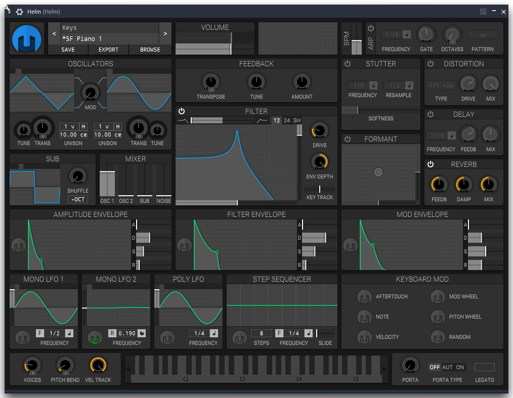

Hello there!

Thanks for checking into our first _real_ blog post on our website! _State of the Game_ is where we write a little about developments on one of our projects, in this case, our first game as Code Calico; 'Snowshoe'!

# Introducing: Snowshoe
Snowshoe (working title, not our final title) is a 2D platformer in development at Code Calico. For Snowshoe, we're drawing inspiration from both recent platforming classics and the good old collect-a-thons of our youth. Snowshoe will follow a cat (I know, big shocker!) on their way to collect trinkets from the wild to bring back to their owner's home. Before I get into the technical nitty-gritty, I'll hand things off to Julie for a little bit of background on what she's doing for the audio of the game!

# Audio
With the audio for this game, I decided to take kind of a unique approach to things. I am working on both SFX and music, so I've taken somewhat similar but different approaches to both of those things.
For UI sounds, I'm actually using a synth preset I found by complete accident while trying to make a song for another game I was working on. I hit a few notes together with this preset and I realized that it would actually sound great for ui sound effects, so I saved the project folder and .wav file just in case the perfect time would come and I would get to use these. I am basing most things off of the one sound effect, with everything being in the same/similar key(s).
For those curious, here is the preset itself:

As for the music in this game, I decided, keeping in with the cat theme to use the [MeowSynth](https://plugins4free.com/plugin/633/). There isn't really any levels yet so I don't have anything planned out for that(usually I build songs for levels around the theme of the level and the gimmicks of it and whatnot), but for the main menu I have two meowsynths, both with a vibrato effect to create sort of a slow vibe, and I took some inspiration from ambient music by using kind of long, drawn out notes fading into each other. I didn't really apply too many effects to the synths because I still want the fact that they're meows to be very audible.

# Code and Engine
To make Snowshoe, we're building in [Godot](https://godotengine.org/), an open-source, fresh yet powerful game engine for both 2D and 3D projects. So far, however, most of our work has involved laying down a good framework to build upon; making sure we get the basics just right. So far this has consisted of Isabelle implementing an easy-to-use debugging interface powered by ImGui, as well as teaming up with Julie in laying the groundwork for scene management, UIs, video settings configurations and building levels. For a team with varied levels of experience with game engines like Godot, such is the case with Code Calico, it's important to make the game easy to develop for every part of our team.
